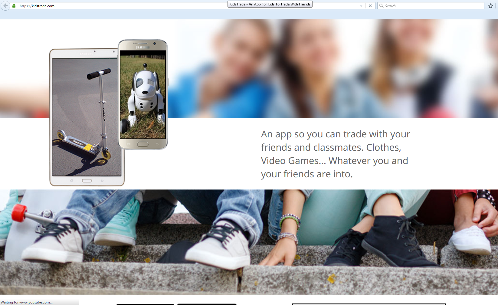

# kidstrade.com

This is a website for Cubbyshop LLC

# Technology Used.

1. language: Ruby
2. platform: Rails
3. front end script: jQuery
4. main gem: devise, solr, sunspot, active admin, braintree, factory_girl, rspec-rails, rspec-solr, rspec-sidekiq, unicorn, geocoder, doorkeeper, grocer, redis, rmagick, carrierwave..
5. main feature: 
>1. Push notification integration.
>2. Payment integration using brain tree.
>3. AWS S3 - file uploading.
>4. Background processing using Sidekiq.
>5. Unit Test using Rspec, capistrano, fatorygirl
>6. Search engine optimization using solr, sunspot
>7. RESTful API for mobile app back end point.

6. hosting: AWS EC2 using Nginx

# Portfolio

